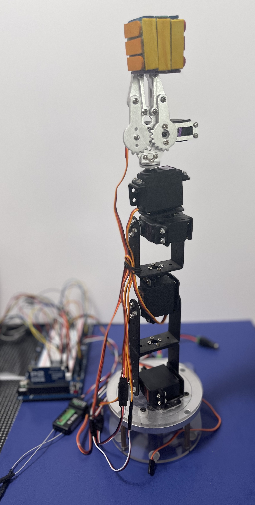
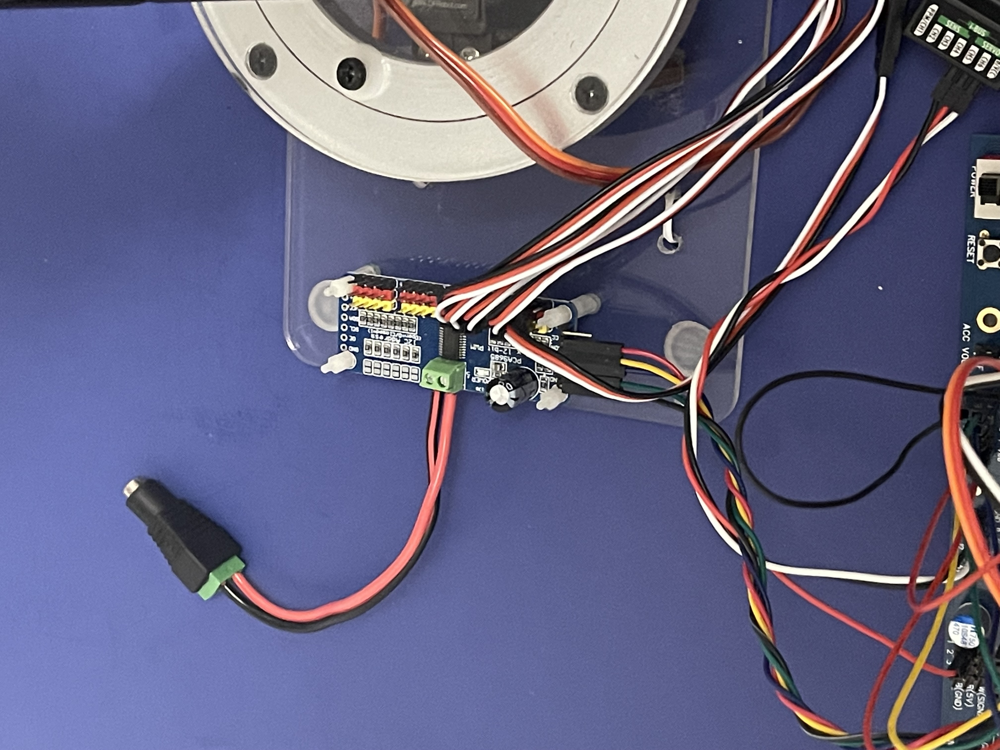

# P2-PCA9685-Servo-Driver

Parallax Propeller V2 Interface object for the I2C 16-chan Servo Driver with demo of 6-Axis arm control

![Project Maintenance][maintenance-shield]

[![License][license-shield]](LICENSE) 

The goal of this project is to produce a P2 Obex object for control of 16-channels of PWM via I2C.

(while the Servos can be controlled directly from the P2, this demonstrates an alternative using fewer wires to control up to 16 servos for a couple of bucks more.)

The demo for this project is some quick software I whipped up to control a 6-axis arm which I'm using to position a motion sensor while i'm developing the motion sensor driver logic.  (This gives me highly repeatable positional testing of the sensor and is frankly quite fun.  *I dreamed of doing this back when I was testing an Apple Watch app that I was building to detect human falls.*)

And as I started in on this I also decided to use JonnyMac's FlySky SBUS support to also control the arm...


**Latest Repo Updates**:

```
28 Aug 2021 14:55
- Better servo ramps
- BUG: arm can just stop <- FIND and FIX!!
26 Aug 2021 17:56
- Arm positions cleaned up, Movement cleaned up.
- Prep'd for moving to better (servo specific) slewing - initial taper (bell curve)
14 Aug 2021 16:36
- Updated this readme with info about files in this repo
20 Jul 2021 16:16
- Moved to separate COG control of servo-slew for smooth arm movements
06 Jul 2021 17:52
- First working flysky positioning of arm so we can setup positions and get servo values
28 Jun 2021 
- Servo slewing is working well
14 Jun 2021 14:45
- Arm is starting to position nicely... now planning needed positions...
06 Jun 2021 17:35
- Just wiring up the hardware so we can develop this driver. 
- Seeding our code base with various starter objects
```

## Current status

I'm working on tapered slew ramps for the arm servo's so there is no inertial rocking when the arm starts/stops moving.  Then I'm adding the final roll/pitch/yaw movement routines for the arm.

After these are completed this demo will take on the form of MPU 9DOF exercisor with the arm moving while I'm gathering 9DOF readings and tuning the algorithms.

## Code Base items of Interest

This section presents the controls and code structure of this project.

### Current FlySky Controls

Figuring out the puposes of the FlySky controls for this use case is proved to be quite interesting...  In the end, I mapped the following controls to functions within the demo program:

Switch | Control Purpose |
--- | ---- |
swA DN | Enable joystick servo control|
swB Toggle  | Display current servo positions
swC UP | Close jaw
swC MID | Partially open jaw
swC DN | Open jaw
swD DN | End control, shutdown program

When SwB is toggled the folllowing output is generated (example):

```bash
--- SERVOS ---
-->  [0-Base]  1500 uSec (90 degr)
-->  [1-Shldr]  800 uSec (0 degr)
-->  [2-Elbow]  1503 uSec (90 degr)
-->  [4-WrFlex]  1497 uSec (89 degr)
-->  [5-WrRota]  1497 uSec (89 degr)
-->  [6-Grip]  1950 uSec (180 degr)
--------------
```

This provides the name of each servo and the current postion (in both uSec and Degrees.)


### Current Compile Structure

Files are compiled as follows:

```
arm6axis_demo.spin2
|-isp_arm_6axis.spin2
|-|-isp_i2c_pca9685.spin2
|-|-|-isp_i2c_singleton.spin2
|-|-|-|-isp_serial_singleton.spin2
|-|-|-|-|-jm_nstr.spin2
|-|-|-isp_serial_singleton.spin2
|-|-isp_i2c_pca9685_servo.spin2
|-|-|-isp_i2c_pca9685.spin2
|-|-|-isp_serial_singleton.spin2
|-|-|-jm_nstr.spin2
|-|-isp_serial_singleton.spin2
|-isp_serial_singleton.spin2
|-isp_flysky_rx.spin2
|-|-jm_sbus_rx.spin2
|-|-|-isp_serial_singleton.spin2
|-|-isp_serial_singleton.spin2
```

### Files of Interest

Filename | Purpose | Notes
----- | ----- | -----
arm6axis_demo.spin2 | Top Level file | Demo routines, vairous bring up routines as we develop this code
isp\_arm_6axis.spin2 | Arm Control routines | (1) knows of arm servos and range of each, (2) contains task for slewing all servos (runs in separate Cog)
isp\_i2c_pca9685.spin2 | pc9685 object | all routes to interact with pca9685
isp\_i2c\_pca9685_servo.spin2 | servo object | servo routines which know servo is attached to channel of pca9685
isp\_i2c_singleton.spin2 | singleton i2c object | jm_i2c object reshaped as singleton
isp\_flysky_rx.spin2 | FlySky methods object (wrapper for SBus object) | New upper level routines providing FlySky control-centric methods
isp\_serial_singleton.spin2 | singleton serial object | jm_serial object reshaped as singleton
jm_nstr.spin2 | JonnyMac's string formatter object | 
jm\_sbus_rx.spin2 | JonnyMac's SBus object | Basic SBus access routines


## My Arm hardware



**Figure 1 - My Arm - Grip, Wrist Spin, Wrist Flex, Elbow, Shoulder, Base**

My arm wired with servos attached to pca9685 board (behind arm). Behind and to left of arm is JonnyMac experiment board with P2 Edge module. The pca9685 is wired via I2C to the P2. just down from the JohnnyMac board is the FlySky servo receiver which is also wired to the JohnnyMac board.



**Figure 2 - pca9685 board providing PWM to all servo channels**

All of the arm servos are connected to this pca9685 board and this board itself is connected to the P2 (JonnyMac board) via I2C.

## Arm hardware from Amazon

- ~ $41 No Servos [diymore Silver ROT3U 6DOF Aluminium Robot Arm Mechanical Robotic Clamp Claw Kits (Unassembled Parts Without Servos)](https://www.amazon.com/diymore-Aluminium-Mechanical-Robotic-Arduino/dp/B01LW0LUPT)
- ~ $70 w/Servos [Dmyond DIY Aluminium Smart 6-Dof Robot Mechanical Arm Robotic Clamp Claw Kit with MG996R Servos 25T Metal Disc Horns and Screw (Robot Mechanical Arm+Servo)](https://www.amazon.com/Dmyond-Aluminium-Mechanical-MEGA2560-Learning/dp/B07XJM1P21)
- ~140 Arm w/Servos Controller and SW [Robotic Arm Kit 6DOF Programming Robot Arm with Handle PC Software and APP Control with Tutorial](https://www.amazon.com/LewanSoul-Robotic-Arduino-Software-Tutorial/dp/B074T6DPKX)

- SEARCH: [More Arms](https://www.amazon.com/s?k=6dof+servo+arm&ref=nb_sb_noss)

- Servos [MG996R clones ~$20 4pk](https://www.amazon.com/4-Pack-MG996R-Torque-Digital-Helicopter/dp/B07MFK266B)

---

> If you like my work and/or this has helped you in some way then feel free to help me out for a couple of :coffee:'s or :pizza: slices! 
> 
> [](https://www.buymeacoffee.com/ironsheep)&nbsp;&nbsp; -OR- &nbsp;&nbsp; [](https://www.patreon.com/IronSheep?fan_landing=true)[Patreon.com/IronSheep](https://www.patreon.com/IronSheep?fan_landing=true)

---

## License

Licensed under the MIT License. <br>
<br>
Follow these links for more information:

### [Copyright](copyright) | [License](LICENSE)


[maintenance-shield]: https://img.shields.io/badge/maintainer-stephen%40ironsheep%2ebiz-blue.svg?style=for-the-badge


[license-shield]: https://img.shields.io/badge/License-MIT-yellow.svg
